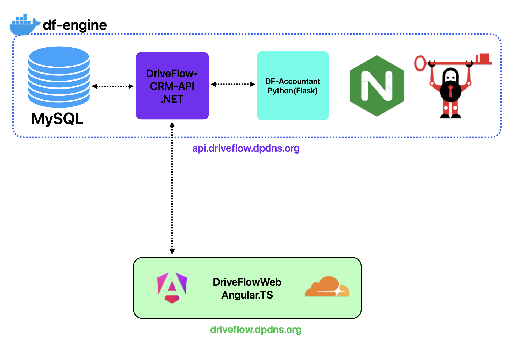

# Inginerie Software - Project Documentation 

[MDS Documentation](README-MDS.md)

## Video Demo's
### [Video Demo v1.0 MDS](https://drive.google.com/file/d/1DTmUk6AoM3rf76YQ2YqiswJvWf_gQ2xk/view?usp=sharing)
### [Video Demo v2.0 IS](https://drive.google.com/file/d/1DTmUk6AoM3rf76YQ2YqiswJvWf_gQ2xk/view?usp=sharing)

## Product Vision

Driveflow CRM este o platformă inteligentă, web-based, care oferă școlilor de șoferi de orice dimensiune precizie, eficiență și simplitate în gestionarea activităților zilnice. Este un sistem ușor, susținut de inteligență artificială, care pune automatizarea și personalizarea în centrul procesului de formare rutieră.

Cu Driveflow, elevii își pot personaliza parcursul de învățare, instructorii economisesc timp prin automatizare, iar școlile beneficiază de programări fluide, generare automată de chitanțe și instrumente moderne de comunicare — totul fără efort. Driveflow CRM nu doar administrează o școală de șoferi, ci o duce mai departe, modernizând complet experiența educației rutiere.

## Product Features

**Driveflow CRM este conceput pentru:**
- elevii care doresc să se perfecționeze după fiecare curs, indiferent de nivelul de experiență;
- instructorii care vor să-și reducă volumul de muncă la jumătate până la sfârșitul zilei;
- școlile de șoferi care își doresc programe ordonate, operațiuni fluide și fără bătăi de cap.

**Noi:**
- te ajutăm să alegi cea mai potrivită mașină și instructor în funcție de stilul tău de învățare;
- facilităm feedbackul direct între elev și instructor;
- generăm programe care se potrivesc perfect atât elevilor, cât și instructorilor.

Driveflow CRM este o soluție flexibilă și completă pentru orice școală de șoferi — indiferent de mărime, echipă sau buget. Prin microservicii, platforma generează automat chitanțe și oferă elevilor instrumentele necesare pentru a-și modela propria experiență de învățare, asigurând că fiecare curs își atinge scopul — fără ca tu să miști un deget.

## Scenarios

### Scenariul 1 – Programari si organizare a sedintelor de conducere

Scheduling Driving Lessons
Andrei este administratorul unei scoli auto din Bucuresti. El este responsabil de programarea lectiilor de conducere pentru elevi si de alocarea instructorilor si vehiculelor disponibile. In prezent, mare parte din aceste programari se realizeaza manual, folosind tabele Excel si apeluri telefonice. Acest proces duce frecvent la erori, suprapuneri si timpi morti intre sedinte.

Pentru a rezolva aceasta problema, scoala adopta un nou sistem digital care permite atat instructorilor, cat si elevilor, sa gestioneze programarile online. Instructorii isi pot marca disponibilitatea saptamanala in sistem, iar elevii pot vizualiza intervalele libere si pot face rezervari direct din aplicatie. Sistemul aloca automat vehiculele disponibile, verifica conflictele si trimite notificari tuturor partilor implicate. Daca un elev doreste sa reprogrameze o sedinta, o poate face din contul sau personal, iar sistemul actualizeaza automat orarul. In acest fel, administratorul reduce timpul petrecut cu planificarea manuala si optimizeaza utilizarea flotei si a personalului.

### Scenariul 2 – Vizualizarea programului zilnic de catre instructor

Instructor’s Daily Schedule
Mihai este instructor auto la aceeasi scoala. Inainte, el isi nota programul zilnic intr-un caiet si verifica manual cine este elevul si ce masina este disponibila. De multe ori, unele sedinte se suprapuneau sau masina atribuita nu era libera.

Prin noul sistem, Mihai se autentifica pe platforma si acceseaza un panou digital care afiseaza programul zilnic. Fiecare sedinta contine numele elevului, modelul vehiculului si locul de intalnire. Daca un elev anuleaza o sedinta, programul se actualizeaza automat. Mihai poate, de asemenea, sa marcheze perioadele in care este indisponibil, iar sistemul nu va permite programari in acele intervale. Aceasta functionalitate elimina confuziile si ii permite sa-si gestioneze eficient timpul.

### Scenariul 3 – Evaluarea progresului elevilor

Tracking Student Progress
Irina este instructor auto cu experienta, responsabila de formarea elevilor inaintea examenului practic. Ea obisnuia sa tina evidenta progresului pe hartie, notand observatii dupa fiecare lectie. Aceste foi se pierdeau adesea, iar elevii nu aveau acces la feedback clar.

Prin noul sistem, dupa fiecare sedinta, Irina acceseaza formularul digital standardizat, identic cu cel folosit la examenul auto, care contine 21 de puncte de evaluare. Ea completeaza observatiile pentru fiecare criteriu si adauga comentarii suplimentare. Dupa salvare, elevul primeste o notificare si poate consulta feedback-ul in contul sau. Sistemul analizeaza istoricul greselilor si sugereaza exercitii personalizate pentru urmatoarele sedinte. Astfel, procesul devine transparent, digital si orientat pe progresul real al elevului.

### Scenariul 4 – Facturare automata si evidenta platilor

Automated Billing and Payment Records
Anca este administrator financiar in cadrul scolii auto. Ea trebuie sa gestioneze facturile pentru sute de elevi lunar. Sistemul vechi presupunea emiterea manuala a documentelor si completarea rapoartelor contabile, ceea ce ducea la intarzieri si erori.

In noul sistem, fiecare plata efectuata de elev genereaza automat o factura digitala. Elevul poate accesa istoricul platilor din contul sau, descarcand facturile in format PDF. Anca are posibilitatea sa exporte rapoarte contabile in formate CSV, Excel sau PDF, utile pentru raportare catre autoritati. Sistemul reduce timpul de procesare, elimina erorile umane si ofera o evidenta clara a tuturor tranzactiilor.

### Scenariul 5 – Managementul flotei de vehicule

Vehicle Fleet Management
Bogdan este responsabil de intretinerea vehiculelor scolii auto. In sistemul actual, el foloseste tabele pentru a urmari datele de revizie, asigurari si kilometraj. Deseori, notificarea expirarii RCA sau a reviziei ajunge prea tarziu, ducand la suspendarea temporara a vehiculului.

Prin noul sistem, fiecare vehicul are un profil digital cu istoricul complet al reviziilor, defectiunilor si verificarilor. Bogdan primeste alerte automate inainte de expirarea documentelor si poate planifica mentenanta preventiv. De asemenea, administratorul poate vizualiza gradul de utilizare al fiecarui vehicul si poate optimiza alocarea acestora intre instructori. In acest mod, flota este mentinuta in stare optima, iar costurile sunt reduse.

### Scenariul 6 – Analiza performantei si rapoarte

Performance Analytics and Reporting
Ioana, directorul scolii auto, doreste o imagine clara asupra activitatii zilnice. Ea are nevoie de date despre numarul de sedinte efectuate, rata de promovare si performanta instructorilor. In trecut, aceste informatii se colectau manual, prin centralizarea fisierelor Excel.

Noul sistem ofera un tablou de bord interactiv cu rapoarte vizuale, grafice comparative si heatmap-uri. Ioana poate analiza performanta individuala a instructorilor, progresul mediu al elevilor si utilizarea vehiculelor. Printr-un singur click, poate exporta rapoarte lunare pentru managementul intern si autoritati. Aceasta functionalitate transforma analiza scolii intr-un proces rapid si strategic.

### Scenariul 7 – Educatie digitala asistata de AI

AI-Based Learning Recommendations
Vlad este elev la scoala auto si are dificultati in manevrele de parcare. Dupa cateva sedinte, sistemul detecteaza ca el repeta aceleasi greseli in evaluarea instructorului. Modulul AI analizeaza istoricul greselilor si ii recomanda videoclipuri, articole si exercitii practice pentru imbunatatire. Vlad poate accesa aceste materiale direct din contul sau si se poate antrena inaintea urmatoarei lectii. In timp, sistemul monitorizeaza progresul si actualizeaza recomandarile. Astfel, procesul de invatare devine personalizat si eficient.

## Descriere Arhitecturală 

### Sinteza

### Diagrame (C4)

## QA

### 1 Verification and Validation
In teste verific raspunsul endpointurilor prin codurile de raspuns HTTP si verific comportamentul prin efectul observabil in date adica dupa creare modificare sau stergere se vede schimbarea in DbContext sau printr un request de citire ulterior 

### 2 Testing Types functional testing si security testing
Testele sunt grupate in functional testing unde sunt verificate operatiile si regulile de domeniu si in security testing unde este verificat accesul la endpointuri prin autentificare si autorizare 

### 3 Basic Software Testing Process
Scenariile pornesc din implementarea reala deoarece rutele metodele si regulile Authorize sunt citite din controllere iar pe baza lor sunt construite cazuri pozitive si negative apoi sunt pregatite date deterministe prin seed si sunt verificate rezultatele prin assert pe raspuns si pe datele din baza in memory 

### 4 Matching testing types with levels
Testele sunt asezate pe nivele astfel incat logica izolata este verificata la nivel unit actiunile controllerului impreuna cu DbContext sunt verificate la nivel integration component iar comportamentul complet al API ului este verificat la nivel system end to end prin HTTP real 

### 5 Unit Testing pe JWT si refresh
La nivel unit sunt verificate componente izolate cu accent pe JWT si refresh prin scenarii valid invalid expirat configuratie invalida si parametri lipsa astfel incat problemele din logica tokenurilor sunt prinse rapid si determinist 

### 6 Integration component testing controller direct cu InMemory
La nivel integration component testele apeleaza direct actiunile controllerelor folosind EF Core InMemory cu baza separata pe fiecare test si seed minim iar pentru input invalid care trebuie sa intoarca 400 ModelState este setat explicit in test deoarece in apel direct nu ruleaza automat validarea din pipeline 

### 7 System testing end to end prin HTTP real
La nivel system end to end aplicatia este pornita in memorie prin CustomWebApplicationFactory in environment Testing cu baza InMemory si seed determinist iar testele trimit cereri HTTP reale ca sa valideze contractul complet al endpointurilor inclusiv raspunsurile de securitate care apar doar in pipeline real 

### 8 Functional testing pe CRUD complet
Pentru entitatile CRUD exista teste cap coada care parcurg creare apoi listare apoi get by id apoi update apoi delete iar la final get by id intoarce 404 ceea ce confirma ca operatiile si persistenta functioneaza corect in sistem 

### 9 Security testing autentificare login si refresh
Autentificarea este verificata prin teste de login si refresh token care includ succes si esec iar tokenul obtinut este folosit pe un endpoint protejat iar scenariile negative acopera credentiale gresite refresh invalid refresh expirat si cont blocat cu 423 

### 10 Security testing autorizare pe roluri si scoping pe AutoSchoolId
Autorizarea este verificata printr o matrice pe endpointurile protejate unde fara token rezultatul este 401 iar cu token dar rol nepermis rezultatul este 403 iar cu rol permis apare succes acolo unde scenariul permite iar separat scopingul pe AutoSchoolId este verificat prin scenarii cross school in care SchoolAdminB nu poate accesa resurse create in SchoolA iar SuperAdmin poate 

### 11 Regression testing prin flowuri cap coada
Pentru regresie exista flowuri cap coada care traverseaza mai multe endpointuri si reguli de business precum Request flow si Availability catre SessionForm iar rezultatele sunt verificate prin status si prin datele returnate inclusiv scenarii negative cu rol nepermis id inexistent tranzitie invalida si conflict overlap 

## Security Analysis
### 1) Confidentiality (cine vede datele)
### RBAC (roluri)
Am implementat control de acces pe roluri (RBAC) cu rolurile: SuperAdmin, SchoolAdmin, Instructor, Student. Asta previne accesul neautorizat la endpoint-uri si date atunci cand un utilizator autenticat incearca sa apeleze functionalitati care nu ii sunt permise conform rolului. In curs asta intra la authorization (ce ai voie sa faci) si protejeaza Confidentiality.

### Tenant isolation (schoolId)
Am implementat verificarea de tenant (schoolId) prin SameSchoolHandler + verificari in controllere, astfel incat un utilizator nu poate accesa resursele altei scoli doar schimbind un id in request. Asta trateaza o vulnerabilitate tipica de tip IDOR (Insecure Direct Object Reference) si reduce riscul de “data leaks” intre scoli. In curs, asta se incadreaza la Confidentiality prin control acces la resurse.

### 2) Integrity (sa nu poti altera datele sau interogarile)
### SQL Injection prevention (Injection attacks)
Am implementat prevenirea SQL injection folosind EF LINQ si query-uri parametrizate, fara concatenare de input in SQL. Asta trateaza atacul de Injection din curs, unde input-ul poate modifica logica query-ului. Prin parametrizare, input-ul ramine data, nu devine comanda, deci nu poate altera interogarea si nu poate modifica/expune date neautorizat.

### Autorizare corecta la modificari
RBAC + tenant checks (schoolId) protejeaza si integritatea, pentru ca un utilizator nu poate face update/delete pe resurse care nu apartin rolului sau scolii lui.

### 3) Availability (sa nu poti bloca aplicatia prin abuz)
### Temporary lockouts (DDoS/abuse defence din curs)
Am configurat lockout in Identity: 5 incercari esuate, 10 minute blocare, iar in API am activat lockoutOnFailure ca sa se aplice la login. Cind contul este blocat, API raspunde cu 423 (cont blocat). Asta trateaza brute force si reduce riscul de abuz pe autentificare, exact ca “temporary lockouts” din curs.

### IP/endpoint abuse control (implementare practica)
Am implementat rate limiting pe endpoint-ul de login (5 req/min pe POST /api/auth) si am adaugat rate limiting si pe endpoint-ul de refresh (/api/auth/refresh). Asta reduce flood-ul pe rutele critice de autentificare si sustine disponibilitatea serviciului, in linie cu apararile din curs pentru DDoS/abuse.

### 4) Session Hijacking (token/session security)
### Session storage mechanisms + changes in duration 
Am implementat doua token-uri separate: JWT access token si refresh token. Refresh token-ul este persistat si validat server-side (se salveaza token-ul si expirarea si se valideaza potrivirea + expirarea la refresh), iar access token-ul are acum durata redusa (60 min → 15–30 min). Durata mai scurta la access token reduce fereastra in care un token compromis poate fi folosit (“changes in duration”), iar refresh token-ul server-side sustine controlul sesiunii (“session storage mechanisms”), exact pe apararile din curs.

### Detection / unusual patterns 
Am adaugat logging pentru login fail, astfel incat pot observa incercari repetate esuate si comportamente anormale. Logging-ul este baza pentru detectie, aliniat cu ideea din curs de detectare a pattern-urilor suspecte.

### 5) XSS (Cross-site scripting) 
### CORS strict (defence explicit in curs)
Am configurat CORS strict in backend, inlocuind AllowAnyOrigin cu origin-ul real al frontend-ului. Asta reduce riscul de request-uri cross-origin neautorizate si este masura listata explicit in curs la apararile pentru XSS.

### Input validation (complet)
Am implementat validare de input pe toate request-urile relevante, astfel incat datele primite sunt verificate inainte sa fie procesate sau salvate (tipuri corecte, limite/range, formate si constrangeri pentru campuri). Aceasta masura sustine apararea din curs pentru XSS prin “input validation” si reduce riscul ca payload-uri malitioase sa ajunga stocate si apoi afisate in UI.

### 6) Authentication (parole)
In aplicatie autentificarea este implementata cu ASP.NET Core Identity, iar parolele sunt gestionate prin mecanismul standard de password hashing. Parola nu este stocata niciodata in clar; la creare/resetare, Identity genereaza un hash (cu salt si parametri de cost) si salveaza doar valoarea in campul PasswordHash, iar la login verifica parola prin rehash + comparare cu hash-ul stocat. Aceasta implementare trateaza riscul de compromitere a parolelor mentionat in curs la autentificarea bazata pe parole si contribuie direct la Confidentiality.

## CI/CD

### Pipeline Overview

| Repository | Workflow | Trigger | Acțiuni |
|------------|----------|---------|---------|
| **DriveFlowWeb** | `ci.yml` | Push/PR pe `main`, `staging` | Install → Test → Coverage → Build → Upload artifacts |
| **DriveFlow-CRM-API** | `deploy.yml` | Push pe `main` | SSH → VPS → Rebuild container `df-api` |
| **DF-Accountant** | `deploy.yml` | Push pe `main` | SSH → VPS → Rebuild container `df-accountant` |
| **df-engine** | `deploy.yml` | Push pe `main` | SSH → VPS → Full stack rebuild |

### Orchestrare cu df-engine

Repository-ul `df-engine` funcționează ca **orchestrator central** pentru întreaga infrastructură DriveFlow. Acesta coordonează deployment-ul tuturor microserviciilor prin Docker Compose și oferă o configurare unificată pentru:

- **Nginx reverse proxy** - rutare trafic către servicii
- **Docker Compose** - orchestrare containere (API, Accountant, MySQL)
- **Git submodules** - referințe către celelalte repository-uri
- **Scripturi de deploy** - automatizare rebuild și restart

Când se face push pe `main` în oricare repository (API, Accountant sau Engine), workflow-ul respectiv execută scriptul `deploy.sh` pe VPS, care:
1. Face `git pull` pentru ultimele modificări
2. Actualizează submodulele dacă e necesar
3. Rebuild-uiește imaginile Docker afectate
4. Restartează containerele **fără a șterge volumele** (datele MySQL persistă)

Această abordare permite **Continuous Deployment** - orice modificare pe branch-ul `main` ajunge automat în producție.

### Branching Strategy

#### DriveFlowWeb (Frontend)
| Branch | Rol | Deployment |
|--------|-----|------------|
| `main` | Cod stabil, producție | Auto-deploy pe VPS |
| `staging` | Testare pre-producție | CI tests + build artifacts |
| `dev` | Dezvoltare activă | Local development |

**Flux:** `dev` → PR → `staging` (testare) → PR → `main` (producție)

Frontend-ul folosește 3 branch-uri pentru a permite:
- Testare completă pe `staging` înainte de release
- Izolarea dezvoltării active de codul stabil
- Review și QA pe fiecare etapă

#### DriveFlow-CRM-API (Backend)
| Branch | Rol | Deployment |
|--------|-----|------------|
| `main` | Producție | Auto-deploy pe VPS via df-engine |
| `dev` | Dezvoltare și testare | Local / staging environment |

**Flux:** `dev` → PR cu code review → `main` (producție)

API-ul folosește 2 branch-uri deoarece:
- Testele unitare (70+) rulează local pe `dev`
- Code review-ul pe PR asigură calitatea înainte de merge
- Deployment rapid în producție după aprobare

#### DF-Accountant (Microserviciu Facturi)
| Branch | Rol | Deployment |
|--------|-----|------------|
| `main` | Producție | Auto-deploy pe VPS via df-engine |
| `dev` | Dezvoltare și testare | Local development |

**Flux:** `dev` → PR → `main` (producție)

Microserviciul de facturare folosește aceeași strategie ca API-ul:
- Serviciu mic și focusat, nu necesită staging separat
- Testare locală suficientă datorită scopului limitat
- Deployment rapid pentru fix-uri și îmbunătățiri

#### df-engine (Orchestrator)
| Branch | Rol |
|--------|-----|
| `main` | Configurație de producție pentru VPS |

**Flux:** Modificări directe pe `main` sau PR-uri pentru schimbări majore

Engine-ul menține doar `main` deoarece:
- Conține doar configurații de infrastructură (Docker, Nginx, scripturi)
- Modificările sunt rare și bine definite
- Testarea se face direct pe VPS (infrastructură identică cu producția)
