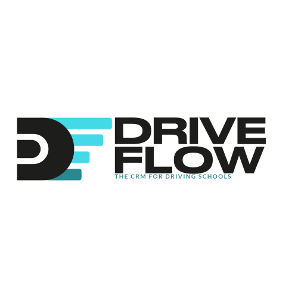

---

DriveFlow CRM simplifică gestionarea școlilor auto prin digitalizarea și automatizarea proceselor manuale, repetitive și predispuse la erori. Această soluție rezolvă următoarele probleme cheie:

- Reducerea timpului de administrare cu ~30-50%.
- Minimizarea riscului de penalități legale.
- Îmbunătățirea experienței elevilor (ceea ce atrage noi clienți).

## 1. User Stories și Backlog Creation

1. **Ca administrator al școlii auto**, vreau să pot gestiona programările elevilor, astfel încât să optimizez utilizarea vehiculelor și programul instructorilor.
   
2. **Ca instructor**, vreau să văd programul meu zilnic, pentru a-mi planifica eficient activitatea.
   
3. **Ca elev**, vreau să pot programa ședințe de conducere online, ca să economisesc timp și să evit deplasările la sediul școlii.
   
4. **Ca manager al școlii**, vreau să pot vizualiza rapoarte de performanță, pentru a identifica oportunitățile de îmbunătățire.
   
5. **Ca administrator financiar**, vreau să pot genera și gestiona facturi automat, pentru a reduce erorile și timpul alocat proceselor manuale.
   
6. **Ca elev**, vreau să primesc notificări despre programul meu și eventualele modificări, pentru a-mi organiza eficient timpul.
   
7. **Ca manager al școlii**, vreau să monitorizez gradul de utilizare al vehiculelor, pentru a optimiza flota și costurile.
   
8. **Ca instructor**, vreau să pot înregistra progresul elevilor după fiecare lecție, pentru a personaliza procesul de învățare.
   
9. **Ca elev**, vreau să am acces la materiale educaționale digitale, pentru a-mi îmbunătăți pregătirea teoretică.
   
10. **Ca administrator**, vreau să pot genera rapoarte pentru autoritățile de reglementare, pentru a asigura conformitatea legală și a evita penalitățile.

11. **Ca manager**, vreau să am acces la statistici despre performanța școlii, pentru a lua decizii strategice informate.

12. **Ca instructor**, vreau să pot marca disponibilitatea mea în sistem, pentru a evita suprapunerile și a optimiza programul.

## 2. Diagrame

### Arhitectura Sistemului
Sistemul DriveFlow CRM este construit pe o arhitectură microservicii, cu următoarele componente principale:

- **DriveFlowWeb** - Frontend implementat în React
- **DriveFlow-CRM-API** - Backend principal implementat în C#/.NET
- **DF-Accountant** - Microserviciu pentru facturare și gestiune financiară

### Workflow Înregistrare Elev
1. Elevul accesează platforma
2. Completează formularul de înregistrare
3. Sistemul validează datele
4. Se creează contul de utilizator
5. Elevul primește un email de confirmare
6. După confirmare, elevul poate accesa platforma și programa ședințe

### Workflow Programare Ședință
1. Elevul se autentifică în platformă
2. Consultă disponibilitatea instructorilor
3. Selectează data și ora dorită
4. Confirmă programarea
5. Sistemul notifică instructorul
6. Elevul primește confirmarea programării prin email

## 3. Source Control cu Git

Gestionarea codului sursă se realizează prin GitHub, folosind cele mai bune practici:

### Branch Creation și Workflow
- Utilizăm modelul **GitFlow** cu branch-uri pentru:
  - `main` - cod stabil, gata de producție
  - `develop` - integrare continuă
  - `feature/nume-funcționalitate` - pentru dezvoltarea noilor funcționalități
  - `bugfix/nume-bug` - pentru rezolvarea bug-urilor
  - `hotfix/nume-problema` - pentru rezolvări urgente în producție

### Merge/Rebase
- Pentru integrarea modificărilor utilizăm:
  - Pull Requests pentru verificarea codului și aprobări
  - Rebase pentru menținerea unui istoric curat
  - Merge doar după review și rezolvarea tuturor comentariilor

### Commits
Proiectul are peste 50 de commits, cu mesaje descriptive care urmează convenția:
- `feat:` pentru funcționalități noi
- `fix:` pentru rezolvarea bug-urilor
- `refactor:` pentru modificări de cod fără schimbarea funcționalității
- `docs:` pentru actualizarea documentației
- `test:` pentru adăugarea sau modificarea testelor

## 4. Teste Automate

Sistemul este testat riguros folosind:

### Unit Testing
- Backend: xUnit pentru testarea componentelor individuale din API
- Frontend: Jest pentru testarea componentelor React

### Integration Testing
- Testarea interacțiunilor dintre microservicii folosind MQTT și message queues
- Verificarea fluxurilor complete de operații prin API endpoints

### E2E Testing
- Testare end-to-end cu Cypress pentru simularea interacțiunilor utilizatorilor
- Scenarii automate care validează funcționarea sistemului ca întreg

### CI/CD
- GitHub Actions pentru rularea automată a testelor la fiecare push
- Pipeline de integrare și deploy automat care asigură calitatea codului

## 5. Raportare Bug și Rezolvare cu Pull Request

Gestionarea bug-urilor se realizează prin:

1. **Identificarea și Raportarea** - Utilizăm sistemul de Issues din GitHub pentru a documenta bug-urile descoperite
2. **Analiza și Prioritizarea** - Evaluăm impactul și urgența fiecărui bug pentru a stabili prioritatea
3. **Rezolvarea** - Creăm branch-uri dedicate pentru rezolvarea bug-urilor (`bugfix/nume-bug`)
4. **Pull Request și Review** - Soluțiile sunt verificate prin PR-uri și code review
5. **Testare** - Verificăm că rezolvarea nu afectează alte funcționalități
6. **Integrare** - După aprobare, modificările sunt integrate în branch-ul principal

Exemplu:
- Bug: [#42 Eroare validare formular înregistrare](https://github.com/DriveFlow-CRM/DriveFlow-CRM-API/issues/42)
- Pull Request: [#45 Fix pentru validarea formularului de înregistrare](https://github.com/DriveFlow-CRM/DriveFlow-CRM-API/pull/45)

## 6. Comentarii Cod și Respectarea Code Standards

### Code Standards
- Folosim StyleCop pentru C# și ESLint pentru JavaScript/TypeScript
- Respectăm convențiile de denumire specifice fiecărui limbaj
- Aplicăm principiile SOLID și Clean Code

### Comentarii Cod
- Fiecare clasă și metodă publică are comentarii XML pentru documentație
- Algoritmii complexi sunt documentați cu explicații detaliate
- Folosim comentarii pentru a explica deciziile de arhitectură și design

### Documentație API
- API-urile sunt documentate cu Swagger/OpenAPI
- Toate endpoint-urile au descrieri clare și exemple de utilizare

## 7. Design Patterns

În implementarea DriveFlow CRM am aplicat următoarele design patterns:

### Factory Pattern în .NET
Am implementat Factory Pattern pentru crearea diverselor tipuri de documente necesare în sistemul nostru (facturi, contracte, rapoarte).

```csharp
// Interfața de bază pentru toate documentele
public interface IDocument
{
    string Title { get; set; }
    string Content { get; }
    void Generate();
    byte[] Export();
}

// Implementări concrete
public class Invoice : IDocument { /* ... */ }
public class Contract : IDocument { /* ... */ }
public class Report : IDocument { /* ... */ }

// Factory Class
public class DocumentFactory
{
    public static IDocument CreateDocument(DocumentType type)
    {
        return type switch
        {
            DocumentType.Invoice => new Invoice(),
            DocumentType.Contract => new Contract(),
            DocumentType.Report => new Report(),
            _ => throw new ArgumentException("Invalid document type")
        };
    }
}

// Utilizare
var invoice = DocumentFactory.CreateDocument(DocumentType.Invoice);
invoice.Title = "Factură cursuri auto";
invoice.Generate();
var pdfBytes = invoice.Export();
```

### Builder Pattern în .NET
Utilizăm Builder Pattern pentru construirea obiectelor complexe cum ar fi rapoartele personalizate, unde avem multe opțiuni configurabile.

```csharp
// Director class
public class ReportGenerator
{
    public Report GenerateStudentProgressReport(ReportBuilder builder, int studentId)
    {
        return builder
            .SetTitle("Raport Progres Elev")
            .SetStudent(studentId)
            .AddSection(ReportSectionType.PersonalInfo)
            .AddSection(ReportSectionType.LessonsHistory)
            .AddSection(ReportSectionType.PerformanceMetrics)
            .AddSection(ReportSectionType.Recommendations)
            .SetFormat(ReportFormat.PDF)
            .Build();
    }
}

// Builder interface
public interface IReportBuilder
{
    IReportBuilder SetTitle(string title);
    IReportBuilder SetStudent(int studentId);
    IReportBuilder AddSection(ReportSectionType section);
    IReportBuilder SetFormat(ReportFormat format);
    Report Build();
}

// Concrete builder
public class StudentReportBuilder : IReportBuilder
{
    private readonly Report _report = new Report();
    private readonly List<ReportSectionType> _sections = new List<ReportSectionType>();
    
    public IReportBuilder SetTitle(string title)
    {
        _report.Title = title;
        return this;
    }
    
    public IReportBuilder SetStudent(int studentId)
    {
        _report.StudentId = studentId;
        _report.Student = _studentRepository.GetById(studentId);
        return this;
    }
    
    public IReportBuilder AddSection(ReportSectionType section)
    {
        _sections.Add(section);
        return this;
    }
    
    public IReportBuilder SetFormat(ReportFormat format)
    {
        _report.Format = format;
        return this;
    }
    
    public Report Build()
    {
        foreach (var section in _sections)
        {
            var sectionContent = _sectionGenerator.GenerateSection(section, _report.Student);
            _report.AddSection(section, sectionContent);
        }
        
        return _report;
    }
}

// Utilizare
var builder = new StudentReportBuilder();
var generator = new ReportGenerator();
var report = generator.GenerateStudentProgressReport(builder, 12345);
```

### Strategy Pattern în .NET
Aplicăm Strategy Pattern pentru a implementa diferite strategii de pricing și algoritmi de programare.

```csharp
// Interfața strategiei
public interface IPricingStrategy
{
    decimal CalculatePrice(Lesson lesson, Student student);
}

// Implementări concrete ale strategiilor
public class StandardPricingStrategy : IPricingStrategy
{
    public decimal CalculatePrice(Lesson lesson, Student student)
    {
        return lesson.BaseCost;
    }
}

public class DiscountPricingStrategy : IPricingStrategy
{
    private readonly decimal _discountPercentage;

    public DiscountPricingStrategy(decimal discountPercentage)
    {
        _discountPercentage = discountPercentage;
    }

    public decimal CalculatePrice(Lesson lesson, Student student)
    {
        return lesson.BaseCost * (1 - _discountPercentage / 100);
    }
}

public class PackagePricingStrategy : IPricingStrategy
{
    public decimal CalculatePrice(Lesson lesson, Student student)
    {
        var packageDiscount = student.Package?.DiscountPercentage ?? 0;
        return lesson.BaseCost * (1 - packageDiscount / 100);
    }
}

// Context class care utilizează strategia
public class PricingService
{
    private IPricingStrategy _pricingStrategy;

    public PricingService(IPricingStrategy pricingStrategy)
    {
        _pricingStrategy = pricingStrategy;
    }
    
    public void SetStrategy(IPricingStrategy pricingStrategy)
    {
        _pricingStrategy = pricingStrategy;
    }
    
    public decimal CalculatePrice(Lesson lesson, Student student)
    {
        return _pricingStrategy.CalculatePrice(lesson, student);
    }
}

// Utilizare
var pricingService = new PricingService(new StandardPricingStrategy());
var normalPrice = pricingService.CalculatePrice(lesson, student);

// Schimbăm strategia pentru un student cu discount
pricingService.SetStrategy(new DiscountPricingStrategy(10));
var discountedPrice = pricingService.CalculatePrice(lesson, student);
```

### Chain of Responsibility Pattern în .NET
Implementăm Chain of Responsibility pentru procesarea validărilor complexe în cadrul sistemului de programare a ședințelor.

```csharp
// Handler base abstract class
public abstract class AppointmentValidationHandler
{
    protected AppointmentValidationHandler Next;
    
    public AppointmentValidationHandler SetNext(AppointmentValidationHandler next)
    {
        Next = next;
        return next;
    }
    
    public abstract ValidationResult Validate(AppointmentRequest request);
}

// Concrete handlers
public class InstructorAvailabilityValidator : AppointmentValidationHandler
{
    private readonly IInstructorRepository _instructorRepository;
    
    public InstructorAvailabilityValidator(IInstructorRepository instructorRepository)
    {
        _instructorRepository = instructorRepository;
    }
    
    public override ValidationResult Validate(AppointmentRequest request)
    {
        var instructor = _instructorRepository.GetById(request.InstructorId);
        
        if (instructor == null)
        {
            return new ValidationResult { IsValid = false, ErrorMessage = "Instructor inexistent" };
        }
        
        var isAvailable = _instructorRepository.CheckAvailability(
            request.InstructorId, 
            request.Date, 
            request.Duration);
            
        if (!isAvailable)
        {
            return new ValidationResult { IsValid = false, ErrorMessage = "Instructorul nu este disponibil în intervalul selectat" };
        }
        
        return Next?.Validate(request) ?? new ValidationResult { IsValid = true };
    }
}

public class VehicleAvailabilityValidator : AppointmentValidationHandler
{
    private readonly IVehicleRepository _vehicleRepository;
    
    public VehicleAvailabilityValidator(IVehicleRepository vehicleRepository)
    {
        _vehicleRepository = vehicleRepository;
    }
    
    public override ValidationResult Validate(AppointmentRequest request)
    {
        var availableVehicle = _vehicleRepository.FindAvailableVehicle(
            request.VehicleType,
            request.Date,
            request.Duration);
            
        if (availableVehicle == null)
        {
            return new ValidationResult 
            { 
                IsValid = false, 
                ErrorMessage = "Nu există vehicule disponibile pentru tipul și intervalul selectat" 
            };
        }
        
        // Atașăm vehiculul la cerere pentru a fi utilizat mai departe
        request.VehicleId = availableVehicle.Id;
        
        return Next?.Validate(request) ?? new ValidationResult { IsValid = true };
    }
}

public class StudentEligibilityValidator : AppointmentValidationHandler
{
    private readonly IStudentRepository _studentRepository;
    
    public StudentEligibilityValidator(IStudentRepository studentRepository)
    {
        _studentRepository = studentRepository;
    }
    
    public override ValidationResult Validate(AppointmentRequest request)
    {
        var student = _studentRepository.GetById(request.StudentId);
        
        if (student == null)
        {
            return new ValidationResult { IsValid = false, ErrorMessage = "Student inexistent" };
        }
        
        if (!student.IsActive)
        {
            return new ValidationResult { IsValid = false, ErrorMessage = "Contul studentului este inactiv" };
        }
        
        if (student.RemainingLessons <= 0)
        {
            return new ValidationResult 
            { 
                IsValid = false, 
                ErrorMessage = "Studentul nu mai are ședințe disponibile în pachet" 
            };
        }
        
        return Next?.Validate(request) ?? new ValidationResult { IsValid = true };
    }
}

// Utilizare
public class AppointmentService
{
    private readonly AppointmentValidationHandler _validationChain;
    
    public AppointmentService(
        IInstructorRepository instructorRepository,
        IVehicleRepository vehicleRepository,
        IStudentRepository studentRepository)
    {
        // Configurăm lanțul de validare
        _validationChain = new StudentEligibilityValidator(studentRepository);
        _validationChain
            .SetNext(new InstructorAvailabilityValidator(instructorRepository))
            .SetNext(new VehicleAvailabilityValidator(vehicleRepository));
    }
    
    public AppointmentResult CreateAppointment(AppointmentRequest request)
    {
        var validationResult = _validationChain.Validate(request);
        
        if (!validationResult.IsValid)
        {
            return new AppointmentResult 
            { 
                Success = false, 
                ErrorMessage = validationResult.ErrorMessage 
            };
        }
        
        // Procesăm cererea dacă toate validările au trecut
        var appointment = _appointmentRepository.Create(request);
        
        return new AppointmentResult
        {
            Success = true,
            AppointmentId = appointment.Id
        };
    }
}
```

### Patterns Structurale
- **Adapter** - Pentru integrarea cu servicii externe (SMS, email)
- **Decorator** - Pentru adăugarea de funcționalități suplimentare la obiectele existente

### Patterns Comportamentale
- **Observer** - Pentru notificări și actualizări în timp real
- **Command** - Pentru implementarea operațiunilor reversibile

### Architecture Patterns
- **Microservices** - Separarea funcționalităților în servicii independente
- **Repository** - Pentru abstractizarea operațiunilor cu baza de date
- **CQRS** - Pentru separarea operațiunilor de citire și scriere

## 8. Prompt Engineering - Documentarea Folosirii Toolurilor de AI

### GitHub Copilot
- Utilizat pentru generarea de cod repetitiv și boilerplate
- Asistență în scrierea unit testelor
- Completarea funcțiilor și metodelor bazate pe comentarii descriptive

### ChatGPT
- Generarea specificațiilor pentru API endpoints
- Asistență în debuggarea problemelor complexe
- Optimizarea interogărilor SQL
- Formularea expresiilor regex pentru validări

### Microsoft Copilot
- Analiza și restructurarea codului existent
- Generarea documentației tehnice
- Asistență în refactorizarea componentelor complexe

### Cursor Agent cu Claude 3.7 și 3.5
- **Design Arhitectural** - Utilizat pentru proiectarea arhitecturii microserviciilor
- **Generare de UML** - Creare de diagrame UML pentru modelarea datelor
- **Refactorizare Cod** - Optimizarea algoritmilor și refactorizarea codului legacy
- **Code Review** - Detectarea bug-urilor potențiale și sugestii de îmbunătățire
- **Generare Unit Tests** - Crearea automată a testelor unitare pentru funcționalitățile critice
- **Debugging Complex** - Rezolvarea problemelor de performanță și a bug-urilor greu de identificat

### Multi-Chain Processors (MCP)
Am utilizat următoarele MCP-uri pentru a extinde capacitățile AI și a optimiza fluxul de dezvoltare:

1. **GitHub Tools MCP** - Pentru integrare directă cu repository-urile și automatizarea workflow-urilor
   ```
   mcp_github_search_repositories
   mcp_github_create_or_update_file
   mcp_github_create_pull_request
   ```

2. **Browser Tools MCP** - Pentru testare și debugging în browser
   ```
   mcp_Browser_Tools_getConsoleLogs
   mcp_Browser_Tools_runAccessibilityAudit
   mcp_Browser_Tools_runPerformanceAudit
   ```

3. **DB Tools MCP** - Pentru optimizarea interogărilor și structurii bazei de date
   ```
   mcp_Supabase_DF_query
   ```

4. **21st DevMagic MCP** - Pentru generare rapidă de componente UI
   ```
   mcp_21st-devmagic_21st_magic_component_builder
   mcp_21st-devmagic_logo_search
   mcp_21st-devmagic_21st_magic_component_inspiration
   ```

5. **Sequential Thinking MCP** - Pentru rezolvarea problemelor complexe prin gândire structurată
   ```
   mcp_sequential-thinking_sequentialthinking
   ```

### Exemple Concrete
1. **Generarea Modelelor**:
   ```csharp
   // Generate a Student class with properties for name, contact info, and enrollment status
   public class Student
   {
       public int Id { get; set; }
       public string FirstName { get; set; }
       public string LastName { get; set; }
       public string Email { get; set; }
       public string Phone { get; set; }
       public DateTime EnrollmentDate { get; set; }
       public bool IsActive { get; set; }
       
       // Navigation properties
       public ICollection<Appointment> Appointments { get; set; }
       public LicenseType LicenseType { get; set; }
   }
   ```

2. **Optimizarea Queries**:
   ```csharp
   // Original query generated manually
   var query = context.Students
       .Where(s => s.IsActive == true)
       .Join(context.Appointments, 
             s => s.Id, 
             a => a.StudentId, 
             (s, a) => new { Student = s, Appointment = a })
       .Where(sa => sa.Appointment.Date > DateTime.Now)
       .Select(sa => sa.Student);
   
   // Optimized query with AI assistance
   var optimizedQuery = context.Students
       .Where(s => s.IsActive)
       .Where(s => s.Appointments.Any(a => a.Date > DateTime.Now));
   ```

3. **Generarea Testelor cu Claude 3.7**:
   ```csharp
   // Generate unit tests for the AppointmentService's CreateAppointment method
   [Fact]
   public async Task CreateAppointment_ValidData_ReturnsAppointmentId()
   {
       // Arrange
       var mockRepo = new Mock<IAppointmentRepository>();
       var mockUnitOfWork = new Mock<IUnitOfWork>();
       mockUnitOfWork.Setup(uow => uow.AppointmentRepository).Returns(mockRepo.Object);
       
       var service = new AppointmentService(mockUnitOfWork.Object);
       var appointmentDto = new AppointmentCreateDto
       {
           StudentId = 1,
           InstructorId = 2,
           Date = DateTime.Now.AddDays(1),
           Duration = 90
       };
       
       var expected = 5;
       mockRepo.Setup(repo => repo.AddAsync(It.IsAny<Appointment>()))
           .ReturnsAsync(new Appointment { Id = expected });
       
       // Act
       var result = await service.CreateAppointmentAsync(appointmentDto);
       
       // Assert
       Assert.Equal(expected, result);
       mockRepo.Verify(repo => repo.AddAsync(It.IsAny<Appointment>()), Times.Once);
       mockUnitOfWork.Verify(uow => uow.SaveChangesAsync(), Times.Once);
   }
   ```

4. **Generare Componente UI cu 21st DevMagic MCP**:
   ```jsx
   // Componenta pentru calendarul de programări generată cu ajutorul 21st DevMagic
   const AppointmentCalendar = () => {
     const [selectedDate, setSelectedDate] = useState(new Date());
     const [appointments, setAppointments] = useState([]);
     
     useEffect(() => {
       // Fetch appointments for the selected date
       fetchAppointments(selectedDate).then(data => {
         setAppointments(data);
       });
     }, [selectedDate]);
     
     return (
       <div className="appointment-calendar">
         <div className="calendar-header">
           <h2>Programări</h2>
           <DatePicker
             selected={selectedDate}
             onChange={date => setSelectedDate(date)}
             dateFormat="dd/MM/yyyy"
           />
         </div>
         <div className="appointments-list">
           {appointments.length === 0 ? (
             <div className="no-appointments">Nu există programări pentru această zi</div>
           ) : (
             appointments.map(app => (
               <AppointmentCard
                 key={app.id}
                 appointment={app}
                 onEdit={() => handleEdit(app.id)}
                 onCancel={() => handleCancel(app.id)}
               />
             ))
           )}
         </div>
       </div>
     );
   };
   ```

## Atașamente

Pentru informații suplimentare, consultați [Prezentarea Checkpoint 2](prezentare-checkpoint-2.pdf)
