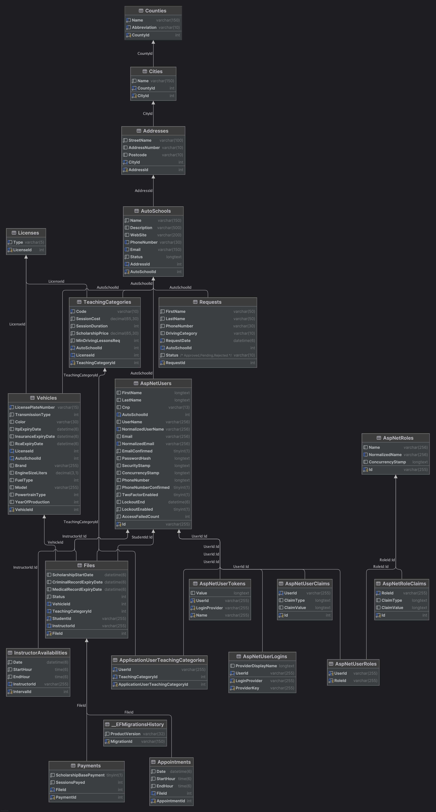
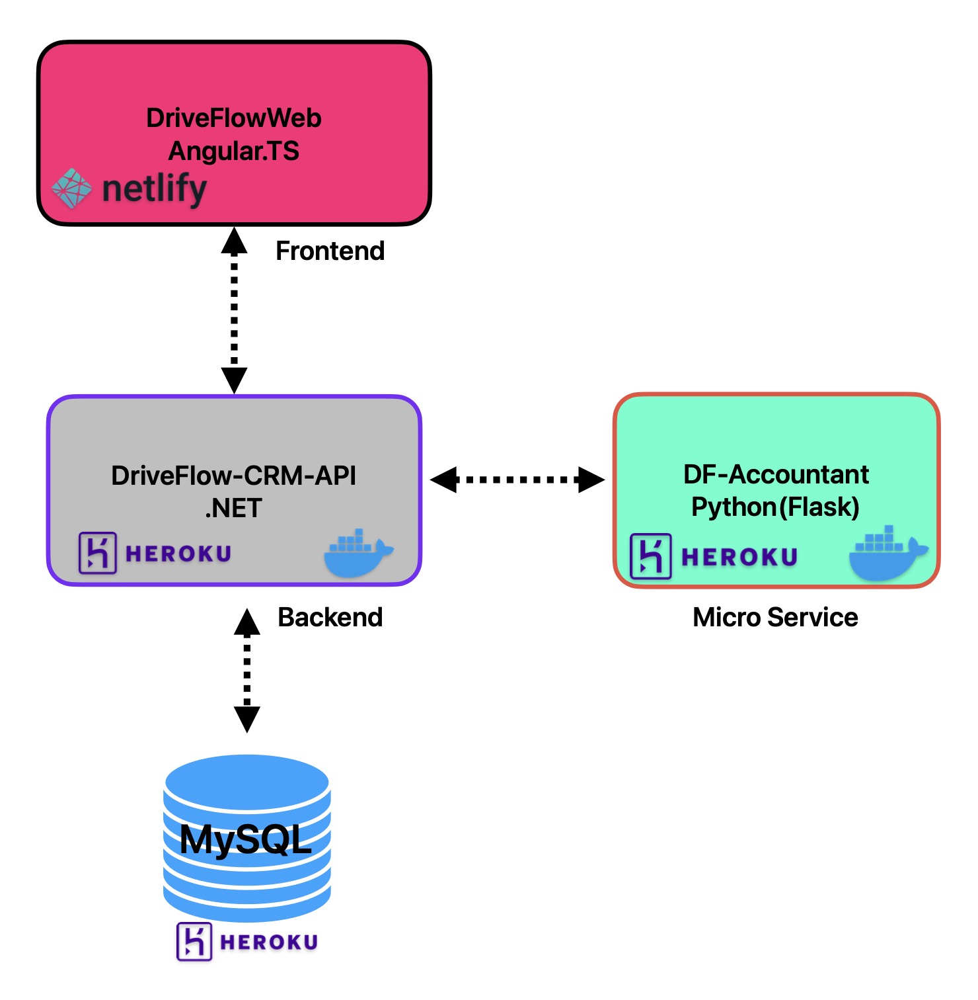
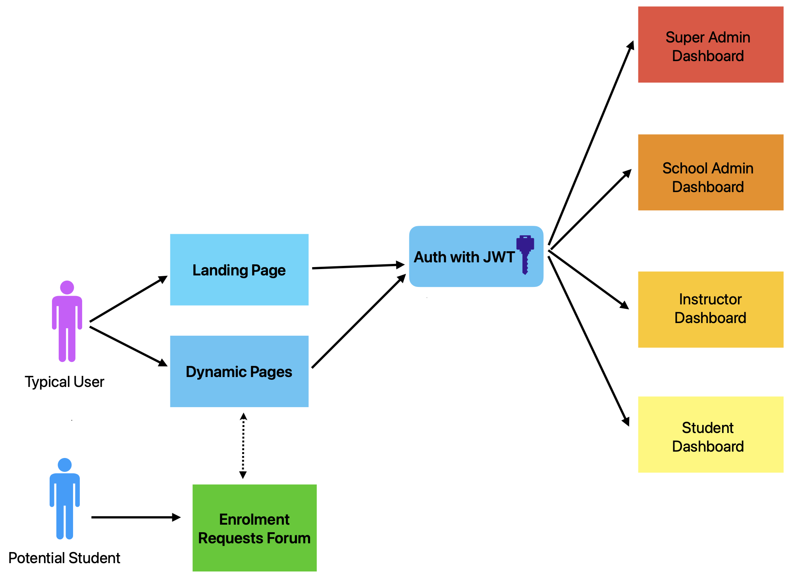
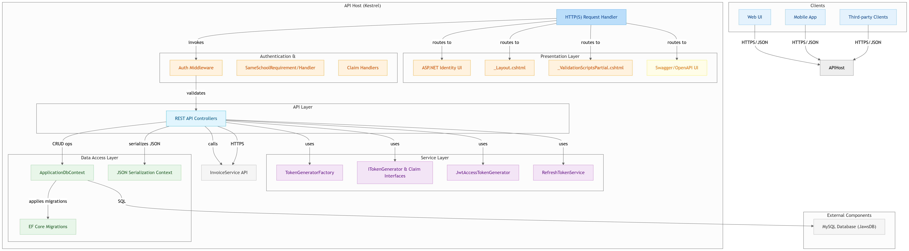
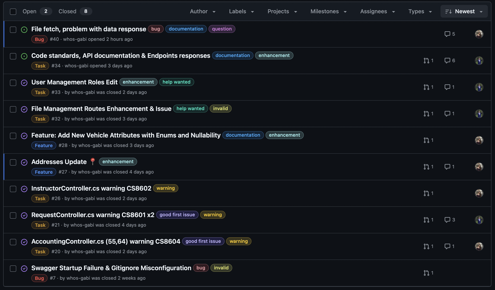

---

DriveFlow CRM simplifică gestionarea școlilor auto prin digitalizarea și automatizarea proceselor manuale, repetitive și predispuse la erori. Această soluție rezolvă următoarele probleme cheie:

- Reducerea timpului de administrare cu ~30-50%.
- Minimizarea riscului de penalități legale.
- Îmbunătățirea experienței elevilor (ceea ce atrage noi clienți).

[Video Demo Link](https://drive.google.com/file/d/1DTmUk6AoM3rf76YQ2YqiswJvWf_gQ2xk/view?usp=sharing)
## 1. User Stories și Backlog Creation

1. **Ca administrator al școlii auto**, vreau să pot gestiona programările elevilor, astfel încât să optimizez utilizarea vehiculelor și programul instructorilor.
   
2. **Ca instructor**, vreau să văd programul meu zilnic, pentru a-mi planifica eficient activitatea.
   
3. **Ca elev**, vreau să pot programa ședințe de conducere online, ca să economisesc timp și să evit deplasările la sediul școlii.
   
4. **Ca manager al școlii**, vreau să pot vizualiza rapoarte de performanță, pentru a identifica oportunitățile de îmbunătățire.
   
5. **Ca administrator financiar**, vreau să pot genera și gestiona facturi automat, pentru a reduce erorile și timpul alocat proceselor manuale.
   
6. **Ca elev**, vreau să primesc notificări despre programul meu și eventualele modificări, pentru a-mi organiza eficient timpul.
   
7. **Ca manager al școlii**, vreau să monitorizez gradul de utilizare al vehiculelor, pentru a optimiza flota și costurile.
   
8. **Ca instructor**, vreau să pot înregistra progresul elevilor după fiecare lecție, pentru a personaliza procesul de învățare.
   
9. **Ca elev**, vreau să am acces la materiale educaționale digitale, pentru a-mi îmbunătăți pregătirea teoretică.
   
10. **Ca administrator**, vreau să pot genera rapoarte pentru autoritățile de reglementare, pentru a asigura conformitatea legală și a evita penalitățile.

11. **Ca manager**, vreau să am acces la statistici despre performanța școlii, pentru a lua decizii strategice informate.

12. **Ca instructor**, vreau să pot marca disponibilitatea mea în sistem, pentru a evita suprapunerile și a optimiza programul.

## 2. Diagrame









## 3. Source Control cu Git

Gestionarea codului sursă se realizează prin GitHub, folosind cele mai bune practici:

### Branch Creation și Workflow
- Utilizăm modelul **GitFlow** cu branch-uri pentru:
  - `main` - cod stabil, gata de producție
  - `develop` - integrare continuă
  - `feature/nume-funcționalitate` - pentru dezvoltarea noilor funcționalități
  - `bugfix/nume-bug` - pentru rezolvarea bug-urilor
  - `hotfix/nume-problema` - pentru rezolvări urgente în producție

### Merge/Rebase
- Pentru integrarea modificărilor utilizăm:
  - Pull Requests pentru verificarea codului și aprobări
  - Rebase pentru menținerea unui istoric curat
  - Merge doar după review și rezolvarea tuturor comentariilor

### Commits
Proiectul are peste 50 de commits, cu mesaje descriptive care urmează convenția:
- `feat:` pentru funcționalități noi
- `fix:` pentru rezolvarea bug-urilor
- `refactor:` pentru modificări de cod fără schimbarea funcționalității
- `docs:` pentru actualizarea documentației
- `test:` pentru adăugarea sau modificarea testelor

## 4. Teste Automate


Sistemul DriveFlow este testat riguros folosind o suită de peste 70 de teste unitare implementate în .NET, acoperind toate componentele critice ale aplicației:

### Unit Testing în .NET

#### Entity Tests
- **AddressPositiveTest / AddressNegativeTest** - Validarea entităților de adresă și a constrângerilor acestora
- **AuthSchoolPositiveTest / AuthSchoolNegativeTest** - Testarea entităților școlilor auto și a regulilor de business
- **CityPositiveTest / CityNegativeTest** - Validarea entităților de orașe și a relațiilor cu alte entități
- **CountyPositiveTest / CountyNegativeTest** - Testarea județelor și a validărilor asociate

#### Authentication & Authorization
- **JwtGeneratorTokenPositiveTest / JwtGeneratorTokenNegativeTest** - Testarea generării și validării token-urilor JWT
- **JwtRefreshTokenPositiveTest / JwtRefreshTokenNegativeTest** - Validarea mecanismului de refresh pentru token-uri
- **RoleClaimsHandler** - Testarea gestionării rolurilor și a permisiunilor

#### Controller Tests
- **RequestController** - Validarea endpoint-urilor pentru gestionarea cererilor
- **AuthController** - Testarea autentificării și înregistrării utilizatorilor
- **AddressController** - Validarea CRUD operațiilor pentru adrese

#### Service Layer Tests
- **StudentService** - Testarea logicii de business pentru gestionarea elevilor
- **InstructorService** - Validarea programărilor și disponibilității instructorilor
- **VehicleService** - Testarea managementului flotei auto

Fiecare test urmărește metodologia AAA (Arrange-Act-Assert) și utilizează mockuri pentru a izola dependențele externe și a asigura testarea precisă a funcționalității specifice.

## 5. Raportare Bug și Rezolvare cu Pull Request



Gestionarea bug-urilor se realizează prin:

1. **Identificarea și Raportarea** - Utilizăm sistemul de [Issues](https://github.com/DriveFlow-CRM/DriveFlow-CRM-API/issues?q=is%3Aissue) din GitHub pentru a documenta bug-urile descoperite
2. **Analiza și Prioritizarea** - Evaluăm impactul și urgența fiecărui bug pentru a stabili prioritatea
3. **Rezolvarea** - Creăm branch-uri dedicate pentru rezolvarea bug-urilor (`bugfix/nume-bug`)
4. **Pull Request și Review** - Soluțiile sunt verificate prin [PR-uri](https://github.com/DriveFlow-CRM/DriveFlow-CRM-API/pulls?q=) și code review
5. **Testare** - Verificăm că rezolvarea nu afectează alte funcționalități
6. **Integrare** - După aprobare, modificările sunt integrate în branch-ul principal

### Cele mai importante Pull Requests:

#### Backend (DriveFlow-CRM-API):
- [PR #16: Enrollment - Îmbunătățiri pentru managementul cererilor](https://github.com/DriveFlow-CRM/DriveFlow-CRM-API/pull/16)
- [PR #10: Implementare controller pentru autentificare](https://github.com/DriveFlow-CRM/DriveFlow-CRM-API/pull/10)
- [PR #5: Implementare Repository pattern și Entity Framework](https://github.com/DriveFlow-CRM/DriveFlow-CRM-API/pull/5)

## 6. Comentarii Cod și Respectarea Code Standards

### Code Standards
- Folosim StyleCop pentru C# și ESLint pentru JavaScript/TypeScript
- Respectăm convențiile de denumire specifice fiecărui limbaj
- Aplicăm principiile SOLID și Clean Code

### Comentarii Cod
- Fiecare clasă și metodă publică are comentarii XML pentru documentație
- Algoritmii complexi sunt documentați cu explicații detaliate
- Folosim comentarii pentru a explica deciziile de arhitectură și design

### Documentație API
- API-urile sunt documentate cu Swagger/OpenAPI
- Toate endpoint-urile au descrieri clare și exemple de utilizare

## 7. Design Patterns


## 8. Prompt Engineering - Documentarea Folosirii Toolurilor de AI

### GitHub Copilot
- Utilizat pentru generarea de cod repetitiv și boilerplate
- Asistență în scrierea unit testelor
- Completarea funcțiilor și metodelor bazate pe comentarii descriptive

### ChatGPT
- Generarea specificațiilor pentru API endpoints
- Asistență în debuggarea problemelor complexe
- Optimizarea interogărilor SQL
- Formularea expresiilor regex pentru validări

### Microsoft Copilot
- Analiza și restructurarea codului existent
- Generarea documentației tehnice
- Asistență în refactorizarea componentelor complexe

### Cursor Agent cu Claude 3.7 și 3.5
- **Design Arhitectural** - Utilizat pentru proiectarea arhitecturii microserviciilor
- **Generare de UML** - Creare de diagrame UML pentru modelarea datelor
- **Refactorizare Cod** - Optimizarea algoritmilor și refactorizarea codului legacy
- **Code Review** - Detectarea bug-urilor potențiale și sugestii de îmbunătățire
- **Generare Unit Tests** - Crearea automată a testelor unitare pentru funcționalitățile critice
- **Debugging Complex** - Rezolvarea problemelor de performanță și a bug-urilor greu de identificat

### Multi-Chain Processors (MCP)
Am utilizat următoarele MCP-uri pentru a extinde capacitățile AI și a optimiza fluxul de dezvoltare:

1. **GitHub Tools MCP** - Pentru integrare directă cu repository-urile și automatizarea workflow-urilor
   ```
   mcp_github_search_repositories
   mcp_github_create_or_update_file
   mcp_github_create_pull_request
   ```

2. **Browser Tools MCP** - Pentru testare și debugging în browser
   ```
   mcp_Browser_Tools_getConsoleLogs
   mcp_Browser_Tools_runAccessibilityAudit
   mcp_Browser_Tools_runPerformanceAudit
   ```

3. **DB Tools MCP** - Pentru optimizarea interogărilor și structurii bazei de date
   ```
   mcp_Supabase_DF_query
   ```

4. **21st DevMagic MCP** - Pentru generare rapidă de componente UI
   ```
   mcp_21st-devmagic_21st_magic_component_builder
   mcp_21st-devmagic_logo_search
   mcp_21st-devmagic_21st_magic_component_inspiration
   ```

5. **Sequential Thinking MCP** - Pentru rezolvarea problemelor complexe prin gândire structurată
   ```
   mcp_sequential-thinking_sequentialthinking
   ```

### Exemple Concrete
1. **Generarea Modelelor**:
   ```csharp
   // Generate a Student class with properties for name, contact info, and enrollment status
   public class Student
   {
       public int Id { get; set; }
       public string FirstName { get; set; }
       public string LastName { get; set; }
       public string Email { get; set; }
       public string Phone { get; set; }
       public DateTime EnrollmentDate { get; set; }
       public bool IsActive { get; set; }
       
       // Navigation properties
       public ICollection<Appointment> Appointments { get; set; }
       public LicenseType LicenseType { get; set; }
   }
   ```

2. **Optimizarea Queries**:
   ```csharp
   // Original query generated manually
   var query = context.Students
       .Where(s => s.IsActive == true)
       .Join(context.Appointments, 
             s => s.Id, 
             a => a.StudentId, 
             (s, a) => new { Student = s, Appointment = a })
       .Where(sa => sa.Appointment.Date > DateTime.Now)
       .Select(sa => sa.Student);
   
   // Optimized query with AI assistance
   var optimizedQuery = context.Students
       .Where(s => s.IsActive)
       .Where(s => s.Appointments.Any(a => a.Date > DateTime.Now));
   ```

3. **Generarea Testelor cu Claude 3.7**:
   ```csharp
   // Generate unit tests for the AppointmentService's CreateAppointment method
   [Fact]
   public async Task CreateAppointment_ValidData_ReturnsAppointmentId()
   {
       // Arrange
       var mockRepo = new Mock<IAppointmentRepository>();
       var mockUnitOfWork = new Mock<IUnitOfWork>();
       mockUnitOfWork.Setup(uow => uow.AppointmentRepository).Returns(mockRepo.Object);
       
       var service = new AppointmentService(mockUnitOfWork.Object);
       var appointmentDto = new AppointmentCreateDto
       {
           StudentId = 1,
           InstructorId = 2,
           Date = DateTime.Now.AddDays(1),
           Duration = 90
       };
       
       var expected = 5;
       mockRepo.Setup(repo => repo.AddAsync(It.IsAny<Appointment>()))
           .ReturnsAsync(new Appointment { Id = expected });
       
       // Act
       var result = await service.CreateAppointmentAsync(appointmentDto);
       
       // Assert
       Assert.Equal(expected, result);
       mockRepo.Verify(repo => repo.AddAsync(It.IsAny<Appointment>()), Times.Once);
       mockUnitOfWork.Verify(uow => uow.SaveChangesAsync(), Times.Once);
   }
   ```

4. **Generare Componente UI cu 21st DevMagic MCP**:
   ```jsx
   // Componenta pentru calendarul de programări generată cu ajutorul 21st DevMagic
   const AppointmentCalendar = () => {
     const [selectedDate, setSelectedDate] = useState(new Date());
     const [appointments, setAppointments] = useState([]);
     
     useEffect(() => {
       // Fetch appointments for the selected date
       fetchAppointments(selectedDate).then(data => {
         setAppointments(data);
       });
     }, [selectedDate]);
     
     return (
       <div className="appointment-calendar">
         <div className="calendar-header">
           <h2>Programări</h2>
           <DatePicker
             selected={selectedDate}
             onChange={date => setSelectedDate(date)}
             dateFormat="dd/MM/yyyy"
           />
         </div>
         <div className="appointments-list">
           {appointments.length === 0 ? (
             <div className="no-appointments">Nu există programări pentru această zi</div>
           ) : (
             appointments.map(app => (
               <AppointmentCard
                 key={app.id}
                 appointment={app}
                 onEdit={() => handleEdit(app.id)}
                 onCancel={() => handleCancel(app.id)}
               />
             ))
           )}
         </div>
       </div>
     );
   };
   ```

## Atașamente

Pentru informații suplimentare, consultați [Prezentarea Checkpoint 2](prezentare-checkpoint-2.pdf)
